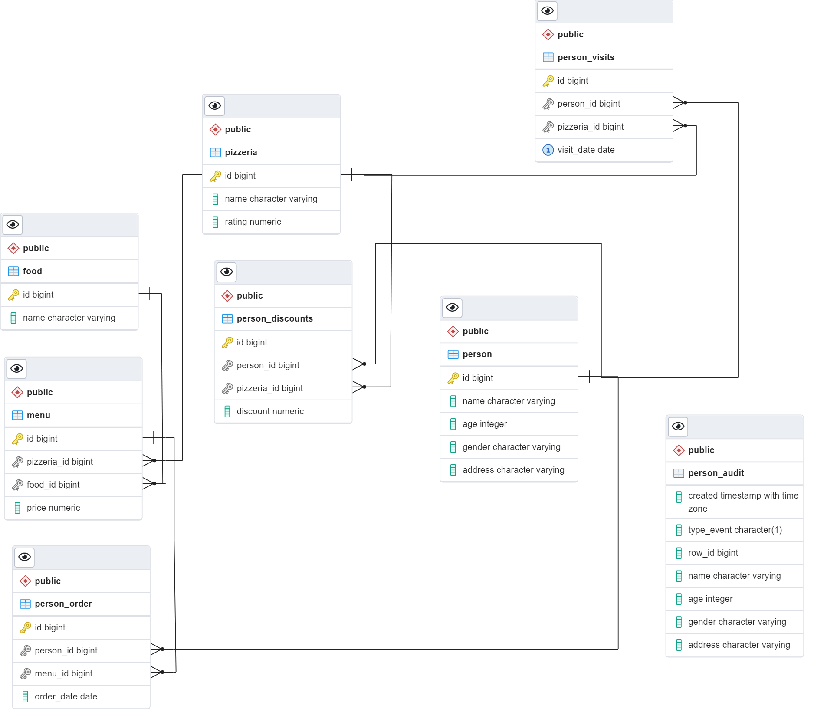

# :pizza: База данных "Пиццерия"

 
 

Также, помимо модели пиццерии (database/model.sql), представлены дополнения к базе данных в виде:

- SQL-запросов (database/query.sql);
- Индексы (database/index.sql);
- Триггеры (database/trigger.sql);
- Функции (database/function.sql);
- Образы (database/view.sql).

 Структура базы данных 

 

# Сборка и удаление

- Ввести в папке **pizzeria/** команду **make all** для сборки базы данных в контейнере;

 

- Ввести в папке **pizzeria/** команду **make sql** для входа в контейнер;

 

- Ввести в папке **pizzeria/** команду **make install** для сборки базы данных в контейнере;

 

- Ввести в папке **pizzeria/** команду **make uninstall** для очищения базы данных, удаления образов и контейнера.
